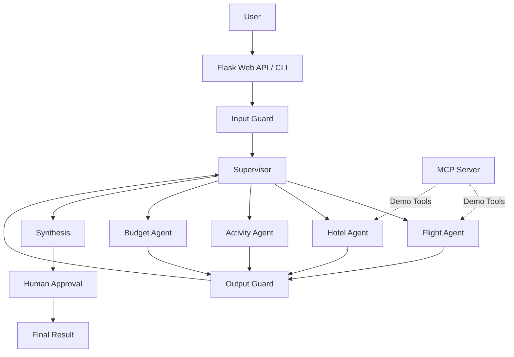

# 🌍 Trip Agent Advanced — Multi-Agent Travel Planning System

[](https://www.python.org/)
[](https://github.com/langchain-ai/langgraph)
[](https://modelcontextprotocol.io/)
[](https://flask.palletsprojects.com/)
[](https://www.docker.com/)
[](LICENSE)

> A modular multi-agent travel planning system built with **LangGraph**, **LangChain**, **MCP**, custom input/output guardrails, and a human approval step.

---

## 📋 Table of Contents

* [Overview](#-overview)
* [Features](#-features)
* [Architecture](#-architecture)
* [Workflow](#-workflow)
* [Tech Stack](#-tech-stack)
* [Project Structure](#-project-structure)
* [Installation](#-installation)
* [Configuration](#-configuration)
* [Usage](#-usage)
* [Agents](#-agents)
* [MCP Integration](#-mcp-integration)
* [Guardrails](#-guardrails)
* [Human Approval](#-human-approval)
* [Web API](#-web-api)
* [Testing](#-testing)
* [Docker](#-docker)
* [Current Limitations](#-current-limitations)
* [Future Improvements](#-future-improvements)
* [License](#-license)

---

# 🧭 Overview

**Trip Agent Advanced** is an experimental multi-agent travel planning application that demonstrates how several specialized AI agents can collaborate through a **LangGraph workflow**.

A user provides a natural-language travel request such as:

> "Plan a 5-day trip to Rome in May with a €1200 budget. I like history and gastronomy."

The system validates the request and uses a supervisor to route the task to specialized agents:

* ✈️ Flight Agent
* 🏨 Hotel Agent
* 🎭 Activity Agent
* 💰 Budget Agent

The agents generate travel-related results using local/demo tools. Their outputs are then passed through an output validation layer before being returned to the supervisor.

The application also includes:

* MCP server/client demonstration
* Input validation
* Prompt-injection pattern detection
* Basic PII masking
* LangGraph checkpointing
* Human approval through the web interface
* Flask REST API
* CLI interface
* Docker support
* Unit tests

> **Important:** The current version uses simulated travel data. It does **not** make real flight, hotel, booking, or payment requests.

---

# ✨ Features

### 🤖 Multi-Agent Architecture

The system separates travel planning into specialized agents:

* Flight search
* Hotel search
* Activity recommendations
* Budget calculation

Each agent is implemented independently and can be replaced or extended with real APIs.

### 🧠 Supervisor Agent

A central supervisor analyzes the conversation and selects the next specialized agent.

The supervisor can route requests to:

```text
flight_agent
hotel_agent
activity_agent
budget_agent
FINISH
```

### 🔄 LangGraph Workflow

The application uses LangGraph to coordinate:

```text
Input
  ↓
Input Guard
  ↓
Supervisor
  ↓
Specialized Agent
  ↓
Output Guard
  ↓
Supervisor
  ↓
Synthesis
  ↓
Human Approval
```

### 🔌 MCP Demonstration

The repository contains an MCP server exposing travel-related tools such as:

```text
search_flights
search_hotels
```

An MCP client is also provided for establishing a local MCP session.

### 🛡️ Custom Guardrails

The project includes lightweight custom guardrails for:

* Input validation
* Prompt-injection pattern detection
* Maximum input length
* HTML removal
* Basic forbidden-topic filtering
* Email masking
* Phone-number masking
* Credit-card masking

### ✋ Human Approval

After itinerary synthesis, the application marks the result as requiring approval.

The Flask interface displays a confirmation dialog allowing the user to approve or reject the proposal.

> This is currently a **human approval mechanism**, not a complete transactional booking system.

### 🌐 Web Interface

A simple Flask web application allows users to submit travel requests and receive the generated itinerary.

### 💻 CLI

The system can also be executed directly from the terminal.

### 🐳 Docker

The project includes:

* `Dockerfile`
* `docker-compose.yml`
* `.dockerignore`

for containerized execution.

---

# 🏗️ Architecture



---

# 🔄 Workflow

## 1. User Request

The user submits a natural-language request:

```text
I want to spend 5 days in Rome.
My budget is €1200.
I like history and gastronomy.
```

## 2. Input Validation

The request is checked for:

* Empty input
* Excessive length
* Basic prompt-injection patterns
* Forbidden topics
* HTML tags

## 3. Supervisor

The supervisor determines which specialized agent should handle the next step.

Example:

```text
User request
     ↓
Supervisor
     ↓
flight_agent
```

After the flight agent returns a result:

```text
flight_agent
     ↓
Output Guard
     ↓
Supervisor
```

The supervisor can then select another agent.

## 4. Specialized Agents

The agents process specific parts of the request:

```text
Flight Agent   → flight options
Hotel Agent    → accommodation options
Activity Agent → activities
Budget Agent   → cost calculations
```

## 5. Output Validation

Agent responses pass through the output guard.

PII such as:

```text
john@example.com
```

can be transformed into:

```text
[EMAIL_MASKED]
```

## 6. Synthesis

The system combines the collected results into a final itinerary.

## 7. Human Approval

The generated proposal is marked for human approval.

The web application displays a confirmation dialog:

```text
Do you confirm this trip proposal?
```

The user's decision is stored in the current application session.

---

# 🧰 Tech Stack

| Component           | Technology                   |
| ------------------- | ---------------------------- |
| Language            | Python 3.10+                 |
| LLM                 | OpenAI via LangChain         |
| Orchestration       | LangGraph                    |
| Agents              | LangGraph / LangChain        |
| Tool Protocol       | Model Context Protocol (MCP) |
| Backend             | Flask                        |
| Validation          | Custom Python guardrails     |
| Logging             | Loguru                       |
| Configuration       | python-dotenv                |
| Testing             | Pytest                       |
| Containerization    | Docker                       |
| State Checkpointing | LangGraph MemorySaver        |
| Frontend            | HTML / CSS / JavaScript      |

---

# 📁 Project Structure

```text
Trip_Agent_avance/
│
├── agents/
│   ├── __init__.py
│   ├── supervisor.py
│   ├── flight_agent.py
│   ├── hotel_agent.py
│   ├── activity_agent.py
│   └── budget_agent.py
│
├── guardrails/
│   ├── __init__.py
│   ├── input_guard.py
│   └── output_guard.py
│
├── mcp/
│   ├── __init__.py
│   ├── server.py
│   └── client.py
│
├── graph/
│   ├── __init__.py
│   ├── state.py
│   └── workflow.py
│
├── templates/
│   ├── index.html
│   └── result.html
│
├── static/
│   ├── css/
│   │   └── style.css
│   └── js/
│       └── app.js
│
├── tests/
│   ├── __init__.py
│   ├── test_agents.py
│   └── test_guardrails.py
│
├── app.py
├── main.py
├── requirements.txt
├── Dockerfile
├── docker-compose.yml
├── .dockerignore
├── .env.example
├── .gitignore
├── LICENSE
└── README.md
```

---

# 🚀 Installation

## 1. Clone the repository

```bash
git clone https://github.com/Hichamjb/Trip_Agent_avance-Multi-Agent-System-using-LangGraph-MCP-Supervisor-Guardrails-HITL.git

cd Trip_Agent_avance-Multi-Agent-System-using-LangGraph-MCP-Supervisor-Guardrails-HITL
```

## 2. Create a virtual environment

### Linux / macOS

```bash
python3 -m venv venv
source venv/bin/activate
```

### Windows

```bash
python -m venv venv
venv\Scripts\activate
```

## 3. Install dependencies

```bash
pip install -r requirements.txt
```

## 4. Configure environment variables

Copy the example configuration:

```bash
cp .env.example .env
```

On Windows:

```powershell
copy .env.example .env
```

Then add your OpenAI API key:

```env
OPENAI_API_KEY=your_api_key_here
```

---

# ⚙️ Configuration

Example `.env`:

```env
# LLM
OPENAI_API_KEY=your_openai_api_key
LLM_MODEL=gpt-4o-mini
TEMPERATURE=0.2

# MCP
MCP_SERVER_URL=http://localhost:8000

# Guardrails
GUARDRAILS_ENABLED=true
GUARDRAILS_STRICT_MODE=false

# Human approval
HITL_ENABLED=true
HITL_TIMEOUT=300

# Flask
FLASK_ENV=development
SECRET_KEY=change_me
PORT=5000

# Logging
LOG_LEVEL=INFO
```

> Never commit your `.env` file or API keys to Git.

---

# 💻 Usage

## CLI

Run:

```bash
python main.py
```

Then enter a request:

```text
🌍 Describe your trip:
5 days in Rome in May, budget €1200, history and gastronomy
```

Or provide the request directly:

```bash
python main.py --query "5 days in Rome in May, budget €1200, history and gastronomy"
```

---

# 🌐 Web Application

Start Flask:

```bash
python app.py
```

Then open:

```text
http://localhost:5000
```

Enter a travel request such as:

```text
Plan a 5-day trip to Rome with a €1200 budget.
I like history, museums and Italian food.
```

The application sends the request to:

```text
POST /api/plan
```

and displays the generated itinerary.

---

# 🤖 Agents

## ✈️ Flight Agent

File:

```text
agents/flight_agent.py
```

Responsibilities:

* Search flight options
* Compare prices
* Compare duration
* Compare number of stops

Current implementation uses **simulated flight data**.

Example:

```text
Air France
€220
2h15
0 stops
```

---

## 🏨 Hotel Agent

File:

```text
agents/hotel_agent.py
```

Responsibilities:

* Search accommodations
* Compare prices
* Compare ratings
* Consider the budget

Current implementation uses simulated hotel data.

---

## 🎭 Activity Agent

File:

```text
agents/activity_agent.py
```

The activity agent maps user preferences to predefined activities.

Supported example preferences include:

```text
history
gastronomy
art
nature
```

For example:

```text
history
```

may return:

```text
Colosseum
Roman Forum
Vatican
Pantheon
```

---

## 💰 Budget Agent

File:

```text
agents/budget_agent.py
```

Responsibilities:

* Calculate total trip costs
* Combine flight, hotel and activity costs
* Perform basic currency conversion

Example:

```python
calculate_budget(
    flights=220,
    hotels=425,
    activities=150,
    misc=100
)
```

Result:

```text
Total = €895
```

The currency conversion rates are currently static demo values.

---

# 🔌 MCP Integration

The repository includes a basic **Model Context Protocol** implementation.

The MCP server is located at:

```text
mcp/server.py
```

Currently exposed tools include:

```text
search_flights
search_hotels
```

The MCP client is located at:

```text
mcp/client.py
```

The client establishes a local MCP session and can retrieve the available tools.

### Important

The current agent implementations still use their own local LangChain tools for the simulated flight and hotel searches.

Therefore, the MCP implementation should currently be considered a **demonstration/integration layer**, rather than the primary execution path of all agents.

A future version can connect the LangGraph agents directly to MCP tools.

---

# 🛡️ Guardrails

The project currently implements lightweight custom guardrails.

## Input Guard

Located at:

```text
guardrails/input_guard.py
```

It checks for:

### Empty input

```text
""
```

### Excessively long requests

Maximum:

```text
4000 characters
```

### Basic prompt-injection patterns

Examples include:

```text
Ignore all previous instructions
```

```text
Forget everything
```

```text
You are now...
```

### HTML removal

Example:

```html
<script>alert(1)</script>
```

is removed from the sanitized input.

---

# 🔐 Output Guard

Located at:

```text
guardrails/output_guard.py
```

It masks basic PII patterns.

Supported examples:

```text
Email
Phone number
Credit-card-like numbers
```

Example:

```text
Contact: test@example.com
```

becomes:

```text
Contact: [EMAIL_MASKED]
```

> These are custom lightweight validation rules. The current implementation does not directly use Guardrails AI or NeMo Guardrails.

---

# ✋ Human Approval

The application includes a human approval stage after itinerary synthesis.

The workflow sets:

```python
requires_approval = True
```

The web interface then displays:

```text
Do you confirm this trip proposal?
```

The decision is sent to:

```text
POST /api/approve
```

Example:

```json
{
  "session_id": "SESSION_ID",
  "approved": true
}
```

### Current behavior

The approval decision is stored in the application's in-memory session.

It does **not** currently trigger a real booking or payment operation.

There are no real irreversible actions implemented yet.

---

# 🌐 Web API

## Create a travel plan

### `POST /api/plan`

Example:

```bash
curl -X POST http://localhost:5000/api/plan \
  -H "Content-Type: application/json" \
  -d '{
    "query": "5 days in Rome, budget €1200, history and gastronomy"
  }'
```

Example response:

```json
{
  "session_id": "example-session-id",
  "itinerary": "...",
  "error": null,
  "requires_approval": true
}
```

---

## Check Status

### `GET /api/status/<session_id>`

Example:

```text
GET /api/status/example-session-id
```

---

## Approve / Reject

### `POST /api/approve`

Example:

```json
{
  "session_id": "example-session-id",
  "approved": true
}
```

---

## Retrieve Result

### `GET /api/result/<session_id>`

Returns the available:

* itinerary
* flights
* hotels
* activities
* budget

---

# 🧪 Testing

Run all tests:

```bash
pytest tests/ -v
```

Run guardrail tests:

```bash
pytest tests/test_guardrails.py -v
```

Run agent/state tests:

```bash
pytest tests/test_agents.py -v
```

The current tests cover:

* Input validation
* Empty input
* Prompt-injection detection
* HTML sanitization
* PII masking
* State structure
* Supervisor routing

---

# 🐳 Docker

Build the image:

```bash
docker build -t trip-agent .
```

Run:

```bash
docker run \
  -p 5000:5000 \
  --env-file .env \
  trip-agent
```

Then open:

```text
http://localhost:5000
```

---

# 🐳 Docker Compose

Run:

```bash
docker compose up --build
```

The project contains two services:

```text
app
│
└── Flask application

mcp-server
│
└── MCP server
```

For production, the application should use a dedicated production WSGI server and persistent storage.

---

# 📦 Requirements

The project uses the following main libraries:

```text
Python
LangChain
LangGraph
LangChain OpenAI
MCP
Flask
Pydantic
python-dotenv
Loguru
Pytest
```

See:

```text
requirements.txt
```

for the complete dependency list.

---

# ⚠️ Current Limitations

This repository is primarily an **AI architecture and multi-agent demonstration**.

The following components are currently simulated or simplified:

### ✈️ Travel APIs

Flight and hotel results are hard-coded demo data.

No real:

* Amadeus API
* Skyscanner API
* Booking API
* Expedia API

is currently connected.

### 🔌 MCP

An MCP server/client is included, but the main agents currently use local LangChain tools instead of dynamically consuming all MCP tools.

### 🛡️ Guardrails

The project contains custom validation logic.

It does not currently implement:

* full Guardrails AI validators
* full NeMo Guardrails configuration
* advanced semantic prompt-injection detection

### ✋ HITL

The current human approval mechanism is implemented at the Flask application level.

It is not yet a full LangGraph `interrupt()` workflow for pausing and resuming execution around an actual external action.

### 💾 Persistence

Sessions are currently stored in memory:

```python
SESSIONS = {}
```

Production deployments should use persistent storage such as Redis or PostgreSQL.

### 💳 Booking

The application does not perform:

* flight booking
* hotel booking
* payment
* cancellation

No real transaction is executed.

---

# 🚀 Future Improvements

The architecture can be extended with:

## Real Travel APIs

Integrate:

* Amadeus
* Skyscanner
* hotel APIs
* weather APIs
* maps and geolocation APIs

## MCP Tool Integration

Connect agents directly to MCP tools:

```text
LangGraph Agent
      ↓
MCP Client
      ↓
MCP Server
      ↓
External API
```

## Advanced HITL

Use LangGraph interruption/checkpoint mechanisms to pause execution before:

```text
Booking
Payment
Cancellation
```

and resume only after explicit user approval.

## Persistent Memory

Replace:

```python
SESSIONS = {}
```

with:

```text
Redis
PostgreSQL
```

## Observability

Add:

* LangSmith tracing
* structured logs
* execution metrics
* agent latency monitoring
* tool-call monitoring

## Better Itinerary Generation

A dedicated itinerary-planning agent can combine:

```text
Flights
+
Hotels
+
Activities
+
Weather
+
Budget
+
User Preferences
```

into a structured daily itinerary.

---

# 🎯 Example

Input:

```text
I want to spend 5 days in Rome in May.
My budget is €1200.
I like history and gastronomy.
```

The system can conceptually produce:

```text
✈️ Flights
- Air France: €220
- Ryanair: €95

🏨 Hotels
- Hotel Roma Centro: €85/night
- Trastevere B&B: €65/night

🎭 Activities
- Colosseum
- Roman Forum
- Vatican
- Trastevere food tour
- Pasta making class

💰 Budget
- Flights
- Accommodation
- Activities
- Miscellaneous expenses

✋ Human Approval
- Confirm proposed trip
```

> Prices and travel options shown by the current version are demonstration data and should not be interpreted as real-time prices.

---

# 🔒 Security Notes

Never commit secrets to Git.

Do not put API keys directly into Python files.

Use:

```text
.env
```

and keep it excluded through:

```text
.gitignore
```

For production, additionally consider:

* secret managers
* authentication
* rate limiting
* HTTPS
* persistent session storage
* stronger prompt-injection detection
* validation of external API responses

---

# 🤝 Contributing

Contributions are welcome.

1. Fork the repository.
2. Create a feature branch:

```bash
git checkout -b feature/my-feature
```

3. Make your changes.
4. Add or update tests.
5. Commit:

```bash
git commit -m "Add my feature"
```

6. Push:

```bash
git push origin feature/my-feature
```

7. Open a Pull Request.

---

# 📄 License

This project is licensed under the MIT License.

See:

```text
LICENSE
```

for details.

---

# 🙏 Acknowledgments

This project uses and is inspired by:

* [LangChain](https://www.langchain.com/)
* [LangGraph](https://github.com/langchain-ai/langgraph)
* [Model Context Protocol](https://modelcontextprotocol.io/)
* [Flask](https://flask.palletsprojects.com/)
* [Docker](https://www.docker.com/)

---

# 👨‍💻 Author

**Hicham Jabbad**

AI Engineer — Generative AI, Agentic AI, RAG and Multi-Agent Systems

GitHub:

https://github.com/Hichamjb

---

## ⭐ Project Summary

**Trip Agent Advanced** demonstrates a modular architecture for building AI-powered travel planning systems using:

```text
Natural Language
       ↓
Input Guard
       ↓
Supervisor
       ↓
┌──────────────┬──────────────┬──────────────┬──────────────┐
│ Flight Agent │ Hotel Agent  │ Activity     │ Budget Agent │
│              │              │ Agent        │              │
└──────────────┴──────────────┴──────────────┴──────────────┘
       ↓
Output Guard
       ↓
Supervisor
       ↓
Itinerary Synthesis
       ↓
Human Approval
       ↓
Final Result
```

The project is designed as a foundation that can be extended with real-world APIs, MCP-based tools, persistent memory, advanced guardrails, observability, and transactional booking workflows.
